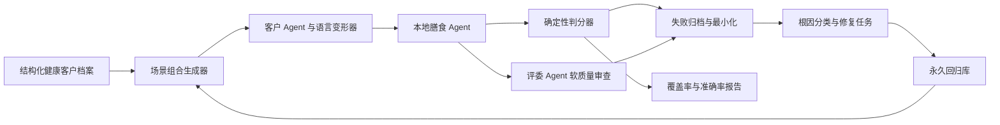

# 个性化膳食 Agent 持续多智能体评测与离线能力沉淀设计

## 1. 背景

当前项目已具备固定评委场景、随机约束组合、营养计算、会话记忆和最小修改测试，但测试重点仍偏向过敏、忌口、数量等基础不变量。项目需要建立长期运行的闭环，持续发现并修复以下更高阶问题：

- 不能理解“增加素菜”“荤素改成 1:2”“不要全是蒸菜”等整桌结构要求；
- 只识别健康标签，却没有让个人健康情况真正影响菜品、营养目标和人均摄入；
- 多轮对话能够记住文字，却不能正确处理追加、撤销、反悔、局部修改和模糊需求；
- 测试数量看似很多，但表达方式、健康情况和组合关系单一；
- 外部模型能够发现新说法，但其判断不稳定，不能直接作为比赛运行依赖或唯一判分标准。

本设计采用“开发期多 Agent 探索、确定性程序核验、能力离线沉淀、提交镜像完全断网”的方案。

## 2. 目标与非目标

### 2.1 目标

1. 建立覆盖个人健康、整桌结构、营养、多轮状态和自然语言变化的生成式测试系统。
2. 使用不同健康情况的客户 Agent 生成持续一致、可追踪标准答案的多轮对话。
3. 使用评委 Agent、红队 Agent 和根因分析 Agent 扩大测试语言和场景范围。
4. 使用本地确定性规则验证菜谱真实性、硬约束、菜单结构、营养和最小修改。
5. 将确认后的失败案例沉淀为离线词典、规则、菜谱特征和永久回归测试。
6. 自动生成覆盖率、准确率、失败分类和性能报告。
7. 自动修复只能进入独立分支和草稿 PR，不自动合并到 `main`。
8. 正式提交的 Docker 镜像不包含外部模型密钥，不依赖互联网或远程 API。

### 2.2 非目标

- 不让外部模型直接决定医学营养结论。
- 不提供疾病诊断、治疗方案或药物相互作用建议。
- 不以随机生成数量替代可解释的覆盖率。
- 不允许为了提高通过率而放宽过敏、忌口或菜谱真实性约束。
- 不在无人审查的情况下自动合并修复。

## 3. 核心原则

1. **硬约束与软质量分离**：过敏、明确忌口和菜谱真实性必须由确定性程序判定；搭配自然度等软指标可由 Agent 提供候选意见。
2. **先有标准答案再生成语言**：先构造结构化场景，再生成口语、同义词、错别字和多轮表达，避免无法判断对错。
3. **同时测试召回和误报**：既检查系统是否识别健康约束，也检查它是否错误添加用户没有表达的约束。
4. **测试前后变化**：对“增加素菜”“减少油炸”等相对要求，比较修改前后菜单指标，不能只搜索回复关键词。
5. **失败必须可复现**：每个失败保存随机种子、完整输入、约束快照、菜单 ID、判分结果和耗时。
6. **修复必须永久化**：确认的 Bug 先写失败回归测试，再修复根因；修复后案例永久保留。
7. **最终运行完全离线**：开发期 Agent 只负责探索和候选评审，比赛 API 的推荐路径不得调用外部服务。

## 4. 总体架构



系统分为四层：

1. **生成层**：健康客户档案、组合生成、自然语言变形和多轮状态机。
2. **执行层**：调用当前本地推荐接口，记录约束、菜单、营养、修改记录和性能。
3. **判分层**：确定性判分器负责可计算指标，多 Agent 负责探索软质量问题。
4. **沉淀层**：失败最小化、回归入库、词典与规则改进、报告和草稿 PR。

## 5. 目录与组件边界

计划新增以下测试组件：

```text
tests/evaluation/
  schemas.py               # 场景、客户档案、标准答案和失败记录的数据结构
  persona_factory.py       # 不同健康情况的合成客户档案
  scenario_generator.py    # 两两、三维和重点高阶组合生成
  language_mutator.py      # 同义词、口语、错别字、否定和省略变形
  dialogue_state_machine.py # 追加、撤销、反悔、局部修改和澄清流程
  deterministic_oracle.py  # 硬约束、真实性、结构、营养和最小修改判分
  metamorphic_oracle.py    # 同义改写和调整前后的关系判分
  failure_minimizer.py     # 缩短失败输入并保留触发条件
  runner.py                # 快速、每日和深度三种运行配置
  report.py                # JSON 与 HTML/Markdown 报告

tests/corpus/
  seeds/                   # 人工确认的基础场景
  regressions/             # 历史 Bug 永久回归案例
  holdout/                 # 修复 Agent 不可见的盲测集合

artifacts/evaluation/      # 每轮运行报告和待审查失败，不进入正式镜像
```

生产代码按测试发现的需求扩展，但保持边界清晰：

- `app/constraints.py`：识别个人健康、整桌结构、相对调整和澄清意图；
- `app/recipe_features.py`：提供荤素、冷热、汤/主食和烹饪方式的确定性特征；
- `app/planner.py`：根据整桌目标组合候选菜；
- `app/menu_revision.py`：按目标差异执行最小修改；
- `app/nutrition_targets.py`：按个人健康情况生成透明、保守的营养目标；
- `app/session_store.py`：保存已确认约束、待澄清问题和菜单版本。

## 6. 结构化场景标准答案

每个测试先生成结构化标准答案，再转换成自然语言。示例：

```json
{
  "persona_id": "multi-condition-001",
  "profile": {
    "gender": "男",
    "age": 62,
    "labor_intensity": "低",
    "special_groups": ["高血压", "高血糖"],
    "allergens": ["花生"],
    "health_goals": ["降压", "控糖", "控制体重"]
  },
  "meal_request": {
    "meal": "晚餐",
    "people_count": 6,
    "dish_count": 6,
    "meat_vegetable_ratio": "1:2",
    "required_categories": ["汤"],
    "minimum_cooking_method_count": 3
  },
  "dialogue_operation": {
    "mode": "minimal_change",
    "preserve_positions": [1, 2],
    "clarification_expected": false
  }
}
```

判分器只根据该结构和实际菜谱数据计算结果，不依赖生成语言的 Agent 自我评价。

## 7. 不同健康情况的客户 Agent

### 7.1 档案分层

每日测试必须包含以下健康客户分层：

- `20%` 健康普通人群：无疾病、无过敏，覆盖不同年龄、性别和劳动强度，用于检查误识别；
- `25%` 单一健康问题：高血压、高血糖、高尿酸、体重管理、血脂或肠胃需求；
- `30%` 多健康问题组合：例如高血压 + 高血糖、高尿酸 + 海鲜过敏、增肌 + 高血压；
- `15%` 特殊人群：备孕、不同孕周、哺乳期、儿童、老人和高强度运动人群；
- `10%` 高风险、信息不足或冲突场景：要求主动澄清、保守提示或拒绝生成医学化结论。

每个测试客户只计入一个主分层，五个主分层合计为 `100%`，避免同一客户被重复统计。过敏、人数、口味、餐次、荤素比例和多轮操作作为正交标签与主分层交叉组合，不改变主分层配额。

### 7.2 官方档案优先覆盖

官方 50 份健康档案的全部字段必须进入覆盖矩阵：

- 性别、年龄、劳动强度；
- 特殊人群和孕周期；
- 口味偏好；
- 过敏食材；
- 健康需求。

官方数据中出现的高血压、高血糖、高尿酸、备孕、孕妇、哺乳期及各类健康需求需要建立固定回归案例。额外疾病在没有可靠规则时只用于测试澄清和安全边界，不直接生成治疗建议。

### 7.3 持续一致的健康状态

客户 Agent 的健康档案分为：

1. 长期档案：年龄、性别、疾病、特殊人群和过敏；
2. 阶段目标：减脂、增肌、控糖、恢复体型等；
3. 本餐状态：今天运动量、食欲、时间和临时口味；
4. 表达策略：一次说完、逐轮透露、隐含表达、纠正或撤销。

长期安全约束不能被一句矛盾请求静默覆盖。明确撤销过敏或疾病信息时，系统应主动确认后再更新。

### 7.4 健康信息的多种表达

同一健康标准答案需要生成显式、隐式和口语表达，例如：

- “我有高血压”；
- “医生让我控制钠”；
- “血压有点高，别做太重口”；
- “我爸六十多岁，平时需要吃得清淡”。

测试同时包含否定和历史描述，避免看到关键词就误判：

- “我没有高血压”；
- “家里其他人血压高，不是我”；
- “以前血糖高，当前是否继续控糖需要确认”。

## 8. 高级测试范围

测试矩阵至少覆盖以下八个维度：

| 维度 | 内容 |
| --- | --- |
| 用户画像 | 年龄、性别、劳动强度、健康普通人和特殊人群 |
| 健康目标 | 减脂、增肌、控糖、降压、低嘌呤及多目标冲突 |
| 硬约束 | 过敏、忌口、不能接受的口味和食材别名 |
| 整桌结构 | 荤素比、冷热比、汤、主食、菜品数量和正式程度 |
| 烹饪方式 | 蒸、炒、炖、煮、炸、烤、凉拌及方法多样性 |
| 营养要求 | 热量、蛋白质、脂肪、碳水、钠和人均摄入 |
| 多轮行为 | 追加、撤销、反悔、局部换菜、全部重做和澄清 |
| 语言表达 | 口语、同义词、错别字、省略、否定、模糊和冲突 |

### 8.1 整桌结构和相对调整

必须覆盖：

- “多来几个素菜”“少点荤菜”；
- “荤素改成 1:2”；
- “不要全是蒸的”“烹饪方式丰富一点”；
- “至少一道汤”“保留主食”；
- “增加素菜，但总菜数和蛋白质不要下降”；
- “前三道确定，只调整后面的菜”。

“提高荤素比例”存在歧义，系统应追问用户希望增加荤菜、增加素菜还是调整为更均衡的比例；“增加素菜”或“改成 1:2”等明确要求直接执行。

### 8.2 变形测试

同一结构化意图生成多种表达，核心约束必须一致。变形包括：

- 同义词和口语；
- 语序调整和省略主语；
- 常见错别字和数字写法；
- 否定、双重否定和历史描述；
- 分多轮透露与一次性表达。

### 8.3 关系型判分

对于相对要求，判分器比较调整前后的菜单：

- “增加素菜”后素菜数必须增加；
- “减少油炸”后油炸菜数量必须下降；
- “烹饪方式丰富”后不同方式数量必须增加或达到阈值；
- “其他菜保留”时只允许修改达到新目标所需的位置；
- “蛋白质不要降低”时人均蛋白质不能超过允许误差下降。

## 9. 多 Agent 开发期职责

### 9.1 客户 Agent

根据结构化健康档案持续扮演同一用户，生成自然、多轮且具有表达差异的需求。客户 Agent 不能修改隐藏标准答案。

### 9.2 高级场景 Agent

生成整桌结构、健康冲突、营养权衡和多人组合等高阶任务，避免只生成关键词过滤题。

### 9.3 评委 Agent

评估解释自然度、澄清是否必要、搭配是否符合常识等软指标，并给出可审查理由。其结论不能覆盖确定性硬约束结果。

### 9.4 红队 Agent

使用反悔、否定套否定、错别字、边界数值、冲突目标和长对话寻找解析及状态漏洞。

### 9.5 根因分析 Agent

根据失败证据将问题归类到：

- 词条或别名缺失；
- 否定与指代解析；
- 健康档案合并；
- 菜谱特征分类；
- 整桌规划；
- 营养目标或计算；
- 多轮会话和最小修改；
- 性能或异常处理。

不同领域可以由子 Agent 并行调查，但共享生产文件的修复必须顺序集成并运行全套回归。

## 10. 确定性判分器

判分器按以下顺序执行：

1. 请求和响应结构合法性；
2. 菜谱 ID、名称和食材与官方菜谱库一致；
3. 过敏和明确忌口零违反；
4. 菜品数量、餐次和人数满足；
5. 个人健康字段抽取精确率和召回率；
6. 荤素、冷热、汤/主食和烹饪方式达标；
7. 整桌总量与人均营养计算一致；
8. 健康目标对营养阈值产生实际影响；
9. 多轮上下文、澄清和最小修改正确；
10. 回复解释与真实菜单及修改记录一致；
11. 首 Token、单轮和多轮性能满足评分要求。

对营养数据覆盖率不足的菜品，不得把未知值当作零或宣称精确达标。

## 11. 持续运行闭环

### 11.1 修改后快速门禁

每次代码修改后运行：

- 全部固定单元和回归测试；
- 高价值健康与整桌场景；
- 固定种子的组合测试；
- 菜谱真实性和硬约束检查。

任何硬约束回归失败时禁止推送修复。

### 11.2 每日广度测试

默认每日运行：

- 不少于 2,000 个确定性组合场景；
- 不少于 100 个多 Agent 新表达或高级场景候选；
- 健康客户分层配额检查；
- 多轮状态和关系型判分；
- 性能分位数统计。

数量可配置，但健康分层和高级场景比例不能因缩小规模而消失。

### 11.3 周期性深度测试

默认每周运行更大的三维和重点高阶组合、长对话、多人健康冲突和盲测集合，用于发现过拟合与低频错误。运行时间和规模可配置，但不得跳过隐藏集和复杂健康组合。

## 12. 失败处理和自动修复边界

失败记录至少包含：

- 场景 ID、随机种子和客户健康档案；
- 原始结构化标准答案和自然语言对话；
- 系统抽取约束、菜单、营养、修改记录和耗时；
- 确定性违反项和 Agent 软评审意见；
- 当前提交 SHA 和运行环境。

处理流程：

1. 失败去重；
2. 自动最小化到仍能复现的最短输入；
3. 确定性复现三次，排除偶发错误；
4. 根因分类；
5. 先新增失败回归测试；
6. 实施单一根因修复；
7. 运行当前案例、同领域测试和全套测试；
8. 在独立分支提交并创建草稿 PR；
9. 不自动合并。

Agent 软评审与确定性判分冲突时，进入待审查列表，不自动修改生产代码。

## 13. 报告与覆盖率

每次每日或深度运行生成：

- 总场景数和总通过率；
- 各健康客户分层的数量和通过率；
- 各测试维度的单维、两两和重点三维覆盖率；
- 约束抽取 precision、recall 和 F1；
- 硬约束违反率和菜谱真实性；
- 整桌结构、营养、多轮最小修改和澄清达标率；
- P50、P95 和多轮平均性能；
- 新失败、重复失败、已修复和待审查数量；
- 最短复现输入和根因分类。

报告不得只显示“运行了多少测试”。

## 14. 质量验收指标

第一阶段强制目标：

- 菜谱真实性：`100%`；
- 已识别过敏和明确忌口违反率：`0%`；
- 明确菜品数量满足率：`100%`；
- 结构化约束抽取 F1：不低于 `95%`；
- 高级整桌调整达标率：不低于 `90%`；
- 多轮上下文保留率：不低于 `95%`；
- 最小修改达标率：不低于 `95%`；
- 模糊需求正确澄清率：不低于 `90%`；
- 确定性测试判分器准确率：不低于 `98%`。

指标按健康分层分别统计，禁止用大量简单健康用户稀释复杂健康场景的失败率。

结构化约束抽取的 precision、recall 和 F1 以人工确认并版本化的标注集为基准，按字段和整体分别统计。确定性判分器准确率以人工复核的金标准菜单与违反项集合为基准；外部 Agent 的评价不能作为该指标的标准答案。标注集变更必须经过代码审查并保留版本，防止通过修改标准答案掩盖回归。

## 15. 隐藏测试与防过拟合

保留一套修复 Agent 不可见的隐藏测试集，包含：

- 未出现在训练词典中的表达；
- 新的健康情况组合；
- 长对话中的撤销和指代；
- 相似关键词但语义相反的负样本；
- 整桌结构和营养权衡。

隐藏集只输出分类后的失败摘要，不直接暴露全部标准答案。正式合并前必须运行隐藏集，避免只记住现有案例。

## 16. 正式提交的离线保证

开发期多 Agent 产生的候选语料和软评审不进入推荐运行路径。正式 Docker 镜像需要满足：

1. 不包含任何外部模型 API Key；
2. 推荐接口不调用外部 HTTP 服务；
3. 词典、规则、营养库、菜谱特征和回归案例随镜像提供；
4. 在 Docker 禁网环境中运行核心测试和 API 冒烟测试；
5. 构建检查发现生产路径引用外部模型 SDK 或远程请求时失败；
6. 缺少开发期 Agent 配置不影响应用启动和推荐。

## 17. 风险与处理

- **Agent 生成无效或医学化场景**：结构化 schema 校验，超出可靠规则的疾病进入澄清/安全边界测试。
- **Agent 评审主观不稳定**：只作为软质量候选，硬指标由本地判分器决定。
- **组合爆炸**：使用两两、三维和风险加权采样，并保留固定随机种子。
- **过拟合回归库**：使用隐藏集、语言变形和新健康组合。
- **自动修复相互冲突**：子 Agent 并行调查、顺序集成，共享文件不并发修改。
- **报告通过但实际体验差**：保留网页人工体验场景和评委 Agent 的解释自然度审查。
- **营养数据不完整**：报告覆盖率和置信度，不以未知值冒充精确数值。

## 18. 完成定义

本阶段只有在以下条件全部满足时才算完成：

1. 健康客户 Agent 分层、结构化标准答案和多轮状态生成可运行；
2. 高级整桌结构与相对调整能够被确定性判分；
3. 每日测试生成覆盖率和准确率报告；
4. 失败可复现、最小化并进入回归库；
5. 至少一个“荤素比例调整”端到端案例通过；
6. 至少一个多健康问题客户的多轮最小修改案例通过；
7. 隐藏测试能够发现过拟合；
8. 外部 Agent 不可用且网络禁用时，正式应用仍可完整启动和推荐；
9. 所有修复只进入草稿 PR，不自动合并。
